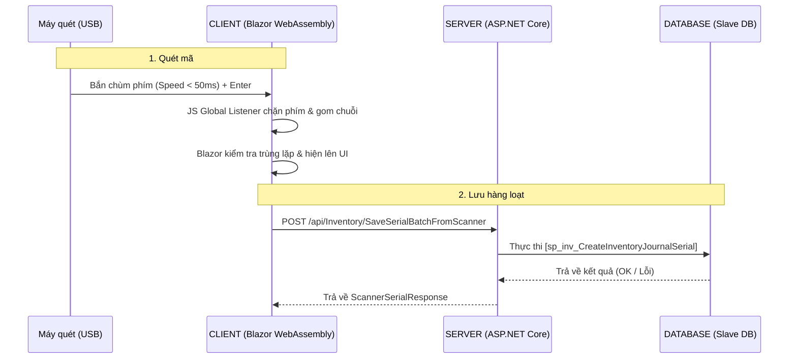

# TÀI LIỆU TỔNG HỢP: TÍNH NĂNG PC SCANNER (BBOS)

Tài liệu này mô tả chi tiết quy trình nghiệp vụ, kiến trúc luồng dữ liệu và các kỹ thuật lập trình đã được áp dụng để xây dựng tính năng Quét mã vạch / QR Code bằng máy quét cầm tay kết nối PC cho hệ thống BBOS Business One.

---

## 1. TỔNG QUAN TÍNH NĂNG (OVERVIEW)

- **Ngữ cảnh:** Trong khu vực xưởng sản xuất, công nhân không được phép mang/sử dụng điện thoại di động cá nhân. Do đó, việc quét mã bằng App Mobile không khả thi.
- **Giải pháp:** Sử dụng máy quét 1D/2D cầm tay cắm vào máy tính (cổng USB).
- **Nguyên lý cốt lõi (Keyboard Wedge):** Máy quét phần cứng thực chất chỉ là một "bàn phím ảo". Khi nó đọc được mã, nó sẽ gõ từng ký tự cực kỳ nhanh vào máy tính và tự động gửi phím `Enter` ở cuối chuỗi. Toàn bộ logic phần mềm được xây dựng xoay quanh nguyên lý tốc độ gõ phím này.

---

## 2. LUỒNG QUY TRÌNH NGHIỆP VỤ (BUSINESS WORKFLOW)

Tính năng được áp dụng trong các màn hình chi tiết phiếu nhập/xuất kho (ví dụ: `SerialDetailList.razor`, `SerialDetailListTransfer.razor`).

1. **Mở Modal:** Người dùng bấm nút `Scan Serial (PC Scanner)` trên thanh công cụ của lưới chi tiết Serial.
2. **Chọn vật tư (Plan A):** Hệ thống load danh sách các vật tư có trong phiếu hiện tại. Người dùng bắt buộc phải chọn 1 dòng vật tư trước khi bắt đầu quét.
3. **Thao tác quét (Rảnh tay):** 
   - Công nhân cầm máy quét bắn liên tục vào các tem mã vạch / QR Code.
   - Hệ thống tự động bắt mã (dù con trỏ chuột đang nằm ở đâu trên màn hình), tự động thêm vào danh sách quét tạm thời trên Modal.
   - Nếu mã bị quét trùng, hệ thống cảnh báo ngay lập tức trên màn hình.
4. **Lưu dữ liệu:** Sau khi quét xong một loạt, người dùng bấm nút **[Save to Document]**. Hệ thống gửi toàn bộ danh sách xuống Backend để lưu vào cơ sở dữ liệu.
5. **Hoàn tất:** Đóng Modal và tải lại lưới dữ liệu chính của phiếu.

---

## 3. LUỒNG KIẾN TRÚC KỸ THUẬT (TECHNICAL DATA FLOW)

Mô hình hoạt động tuân theo kiến trúc Client-Server chuẩn của BBOS:



---

## 4. PHÂN TÍCH CHI TIẾT CODE & THUẬT TOÁN (DEEP DIVE)

Phần này giải thích tường tận cách các dòng code giao tiếp với nhau để đảm bảo khả năng quét liên tục (Real-time Continuous Scanning) mà không bị nghẽn (Blocking).

### 4.1. Kiến trúc Dữ liệu (Data Models)
Hệ thống sử dụng các DTO (Data Transfer Object) chuyên biệt nằm trong file `ScannerModels.cs` để chuẩn hóa giao tiếp:
- **`ScanSerialRow`**: Class dùng nội bộ trên giao diện Blazor để hứng dữ liệu tạm thời (chứa `ItemCode`, `ItemName`, `ItemSerialNo`...).
- **`ScannerSerialRequest`**: Class gói gọn dữ liệu gửi từ Client xuống Backend qua API.
- **`ScannerSerialResponse`**: Class API trả về chứa trạng thái `Success` (true/false) và `Message` (Lý do thành công/lỗi) cho từng mã Serial riêng biệt.

### 4.2. Khởi tạo Cầu nối JS - C# (Interop Bridge)
Để Javascript có thể gọi ngược lại C# mỗi khi bắt được mã vạch, Blazor cần cấp một "tấm vé" ủy quyền.
Trong hàm `OnInitialized()` của `ScannerModal.razor`:
```csharp
// Khởi tạo tham chiếu đến chính Component này
objRef = DotNetObjectReference.Create(this);
```
Trong hàm `OnAfterRenderAsync()`, C# sẽ truyền `objRef` này xuống một biến toàn cục của window (`window.bbosDotNetHelper`). Từ lúc này, JS và C# đã thông nhau.

### 4.3. Cơ chế bắt phím "Tàng hình" & Đo tốc độ (Global Wedge Listener)
Thay vì bắt công nhân phải liên tục click chuột vào một ô Textbox để con trỏ (cursor) nhấp nháy, ta gắn một Listener tóm gọn mọi phím được gõ trên toàn bộ trình duyệt (`window.addEventListener('keydown',...)`).

**Làm sao để biết đó là máy quét hay là người gõ phím?**
Thuật toán so sánh Delta Time (Độ trễ thời gian giữa 2 phím liền kề):
```javascript
window.bbosScannerListener = function(e) {
    if (e.ctrlKey || e.altKey || e.metaKey) return; // Bỏ qua nếu bấm phím tắt
    
    let now = Date.now();
    // Nếu khoảng cách gõ 2 phím lớn hơn 50 mili-giây -> Chắc chắn là con người gõ -> Xóa rác
    if (now - window.bbosLastKeyTime > 50) {
        window.bbosBarcodeBuffer = ''; 
    }
    window.bbosLastKeyTime = now;

    // ... (Xử lý phím Enter nằm ở mục 4.4 bên dưới) ...

    // Tích lũy phím nếu gõ nhanh (tốc độ < 50ms)
    else if (e.key.length === 1) {
        window.bbosBarcodeBuffer += e.key; 
    }
};

// Gắn Listener vào Window với capture = true để hứng sự kiện đầu tiên
window.addEventListener('keydown', window.bbosScannerListener, true);
```
*Lưu ý:* Việc dùng cờ `capture: true` rất quan trọng. Nó giúp hàm JS này tóm lấy sự kiện phím gõ từ tận ngoài cùng trình duyệt, chặn đứng nó lại trước khi nó kịp truyền tải (propagate) chui xuống các thẻ `<input>` hay `<form>` nằm tít bên trong giao diện HTML. Điều này ngăn ngừa hoàn toàn tình trạng mã vạch bị gõ nhầm lung tung trên màn hình.

### 4.4. Đẩy dữ liệu Thời gian thực (Real-time Dispatching)
Máy quét luôn có một quy tắc: Khi đọc xong mã vạch, nó tự động gửi phím **`Enter`**. 
Đây là điểm kích nổ. Ngay khi JS nhận được phím `Enter`:
```javascript
if (e.key === 'Enter' && window.bbosBarcodeBuffer.length >= 2) {
    e.preventDefault(); // Chặn hành vi mặc định (Submit form/Reload trang)
    var code = window.bbosBarcodeBuffer; // Lưu mã vừa gom
    window.bbosBarcodeBuffer = '';       // Xóa bộ đệm chuẩn bị đón mã mới
    
    // GỬI CHUỖI VỀ BLAZOR C# NGAY LẬP TỨC
    window.bbosDotNetHelper.invokeMethodAsync('OnGlobalBarcodeScanned', code);
}
```
**Tại sao cách này giúp quét "Liên tục" (Continuous)?**
Vì JS đẩy data bất đồng bộ (`invokeMethodAsync`) về C#, giải phóng luồng (thread) JS ngay lập tức. Công nhân có thể bóp cò liên thanh (1 giây 5 mã), JS vẫn hứng đủ 5 mã và đẩy về C# 5 lần độc lập mà không cần chờ C# render xong giao diện.

### 4.5. Blazor xử lý & Hiển thị UI
Bên phía C#, một hàm được đánh dấu `[JSInvokable]` sẽ đứng ra hứng chuỗi do JS ném về:
```csharp
[JSInvokable]
public async Task OnGlobalBarcodeScanned(string barcode)
{
    // 1. Kiểm tra trùng lặp (Duplicate Detection)
    if (scannedSerials.Any(x => x.ItemSerialNo == barcode)) {
        ShowWarning($"Mã {barcode} đã tồn tại!"); return;
    }
    
    // 2. Thêm vào danh sách tạm (Local RAM)
    scannedSerials.Add(new ScanSerialRow { ItemSerialNo = barcode, ... });
    
    // 3. Ép giao diện vẽ lại để hiện mã mới lên lưới
    StateHasChanged();
    
    // 4. Lưu nháp vào ổ cứng trình duyệt (Chống mất điện)
    await SaveDraftAsync();
}
```

### 4.6. Trả dữ liệu về Server (Batch Save)
Thay vì mỗi lần nhận 1 mã, Blazor lại gọi API (làm đứng máy, xoay vòng tròn chờ mạng), hệ thống gom tất cả dữ liệu lại. Chỉ khi công nhân chủ động bấm nút **[Save to Document]**, C# mới tạo Payload chứa hàng loạt Serial gửi đi 1 lần duy nhất:
```csharp
var payload = new Dictionary<string, object> {
    { "DocumentId", Header.Id },
    { "SerialList", JsonSerializer.Serialize(serialInputList) }
};
var results = await Http.Post<List<ScannerSerialResponse>>("api/Inventory/SaveSerialBatchFromScanner", payload);
```
Server sẽ gọi Database thực thi Stored Procedure `sp_inv_CreateInventoryJournalSerial` theo dạng Bulk Insert / Vòng lặp. Sau đó trả mảng `ScannerSerialResponse` về Client. Client sẽ đếm số lượng bản ghi có `Success == true` để báo xanh, và hiện thông báo lỗi cho các dòng `Success == false` (VD: Hàng đã tồn tại trong kho khác, Lô đã xuất hết, v.v.).

## 5. KỊCH BẢN CHẠY REALTIME NGOÀI THỰC TẾ (PRODUCTION DEPLOYMENT)

Khi áp dụng tính năng này xuống xưởng sản xuất thực tế, có một số lợi thế và kịch bản vận hành cần lưu ý:

### 5.1. Tối ưu hóa độ trễ mạng (Zero-Latency Scanning)
- Khác với một số hệ thống gọi API ngay lập tức cho mỗi lần tít mã, cơ chế của chúng ta xử lý **tích lũy hoàn toàn ở Client (Blazor WebAssembly)**.
- Khi công nhân quét liên tục (ví dụ: quét 50 thùng hàng trong 10 giây), danh sách được đẩy ngay vào bộ nhớ RAM của trình duyệt mà không cần chờ Server phản hồi.
- Điều này loại bỏ hoàn toàn độ trễ mạng (Network Latency) trong lúc quét, công nhân không phải chờ "quay vòng vòng" sau mỗi lần bóp cò súng quét.

### 5.2. Chống dội mạng & Giao dịch an toàn (Batch Processing)
- Toàn bộ dữ liệu chỉ được đẩy qua API khi công nhân chủ động bấm **[Save to Document]**.
- Server sẽ xử lý theo dạng **Batch (Lô)**: Gửi 1 mảng 50 serials xuống Stored Procedure cùng lúc. Cách này giảm tải kết nối DB và API cực kì hiệu quả.
- Nếu bị rớt mạng Wi-Fi giữa chừng lúc đang quét, công nhân không bị mất dữ liệu. Họ cứ giữ nguyên màn hình, chờ có mạng lại rồi bấm **[Save]** là dữ liệu vẫn lên an toàn.

### 5.3. Cơ chế chống mất điện (Local Storage Auto-Save)
- **Vấn đề:** Vì dữ liệu quét lưu tạm trên RAM, nếu máy tính sập nguồn (mất điện) hoặc người dùng lỡ tay nhấn dấu X tắt trình duyệt, RAM sẽ bị xóa sạch gây mất dữ liệu quét dở.
- **Giải pháp - Ghi vào Ổ cứng vật lý:** Hệ thống tích hợp tính năng **Auto-save**. Mỗi tiếng "Tít" vang lên và một mã quét được thêm vào, code C# sẽ lập tức kích hoạt JS để lưu mảng dữ liệu xuống bộ nhớ `localStorage` (tức là ghi vật lý lên ổ cứng của máy tính công nhân). 
```csharp
// Lưu trữ nháp ngay lập tức sau mỗi lần quét (Tốc độ < 1ms)
var json = System.Text.Json.JsonSerializer.Serialize(scannedSerials);
await JsRuntime.InvokeVoidAsync("localStorage.setItem", GetDraftKey(), json);
```
- **Phục hồi thần kỳ:** Vì dữ liệu đã nằm trên ổ cứng vật lý, nên dù bị cúp điện tối thui màn hình, dữ liệu vẫn an toàn. Khi có điện lại, công nhân mở trình duyệt, vào lại phiếu cũ và bật bảng Scan lên. Code khởi tạo sẽ lục trong ổ cứng ra bản nháp cuối cùng:
```csharp
// Khôi phục dữ liệu cũ khi vừa mở bảng Scan lên
var json = await JsRuntime.InvokeAsync<string>("localStorage.getItem", GetDraftKey());
var draft = System.Text.Json.JsonSerializer.Deserialize<List<ScanSerialRow>>(json);
```
Hệ thống tự khôi phục lại y chang danh sách cũ và báo: *"Restored X unsaved serial(s) from previous session!"*.
- **Khi nào thì xóa bản nháp?** Chỉ khi nào có mạng, công nhân bấm nút **[Save to Document]** và API trả về kết quả lưu vào Database thành công, thì lệnh dọn dẹp ổ cứng chuẩn bị cho phiên quét mới mới được kích hoạt:
```csharp
await JsRuntime.InvokeVoidAsync("localStorage.removeItem", GetDraftKey());
```

### 5.4. Cấu hình máy quét phần cứng (Hardware Configuration)
- Hầu hết các súng quét USB ngoài thị trường (Zebra, Honeywell, Datalogic...) đều có chức năng **Suffix: Enter** (Tự động thêm phím Enter sau mỗi mã vạch) được bật mặc định.
- Nếu xưởng mua dòng máy quét đặc thù chưa bật tính năng này, người quản trị chỉ cần lấy sách hướng dẫn đi kèm của máy quét, dùng máy quét quét vào mã vạch có chữ "Add Enter Key" là xong, hoàn toàn không cần phải sửa code phần mềm.

---

## 6. NHỮNG LƯU Ý QUAN TRỌNG KHI VẬN HÀNH (GOTCHAS)

> [!WARNING]
> **Xung đột bộ gõ Tiếng Việt (Unikey/EVKey)**
> Máy quét là bàn phím. Nếu trên Windows đang bật Unikey (chữ V), khi quét mã `test2`, nó sẽ gõ cực nhanh `t-e-s-t-2`. Unikey sẽ nhảy vào nối `e` + `s` = `é`. Kết quả mã vạch ra chữ `tét2` gây sai lệch dữ liệu.
> **Khắc phục:** Bắt buộc chuyển bộ gõ sang Tiếng Anh (chữ E) trước khi dùng máy quét.
